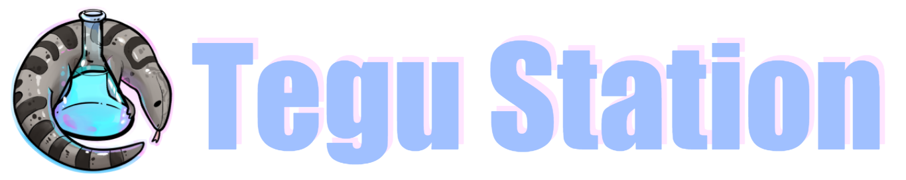

### 
### Welcome to the alternative code repository for **TeguStation**, a modified fork of [BayStation 12](https://github.com/Baystation12/Baystation12) created on 05-06-2021.
## For the first repository visit: [TeguStation](https://github.com/vlggms/tegustation)

  

## Community

Discord is the place where most of the discussion happens, due to absence of a forum. Here you can contact administrators, ask mentors for help, or simply discuss your rounds. It is also a place where you can find links to ban appeals, admin applications and others, which could be really useful.

**Space Station 13** is a paranoia-laden round-based roleplaying game set against the backdrop of a nonsensical, metal death trap masquerading as a space station, with charming spritework designed to represent the sci-fi setting and its dangerous undertones. Have fun, and survive!

## Information
* **Code:** https://github.com/vlggms/tegustation-bay12
* **SS13 Coderbus Discord:** https://discord.gg/Vh8TJp9
* **/tg/Station Wiki:** https://tgstation13.org/wiki/Main_Page

## Downloading and running a server
[Downloading](.github/DOWNLOADING.md)

[Running on the server](.github/RUNNING_A_SERVER.md)

[Maps and Away Missions](.github/MAPS_AND_AWAY_MISSIONS.md)

## Contributing
[Guidelines for Contributors](.github/CONTRIBUTING.md)

[Documenting your code](.github/AUTODOC_GUIDE.md)

[Policy configuration system](.github/POLICYCONFIG.md)

[Interested in some starting lore? (/tg/)](https://github.com/tgstation/common_core)

## LICENSE

Code with a git authorship date prior to `1420675200 +0000` (2015/01/08 00:00 GMT) is licensed under the GNU General Public License version 3, which can be found in full in [/docs/GPL3.txt](/docs/GPL3.txt)

All code where the authorship dates on or after `1420675200 +0000` is assumed to be licensed under AGPL v3, if you wish to license under GPL v3 please make this clear in the commit message and any added files.

The TGS DMAPI API is licensed as a subproject under the MIT license.

See the footer of code/__DEFINES/tgs.dm and code/modules/tgs/LICENSE for the MIT license.

If you wish to develop and host this codebase in a closed source manner you may use all commits prior to `1420675200 +0000`, which are licensed under GPL v3.  The major change here is that if you host a server using any code licensed under AGPLv3 you are required to provide full source code for your servers users as well including addons and modifications you have made.

See [here](https://www.gnu.org/licenses/why-affero-gpl.html) for more information.

All assets including icons and sound are under a [Creative Commons 3.0 BY-SA license](https://creativecommons.org/licenses/by-sa/3.0/) unless otherwise indicated.
